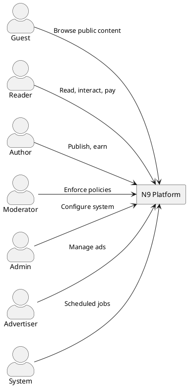
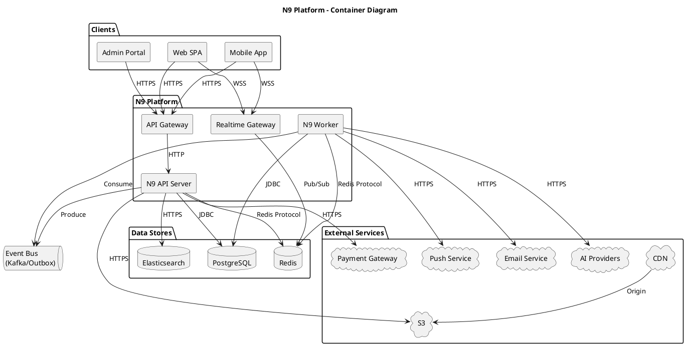
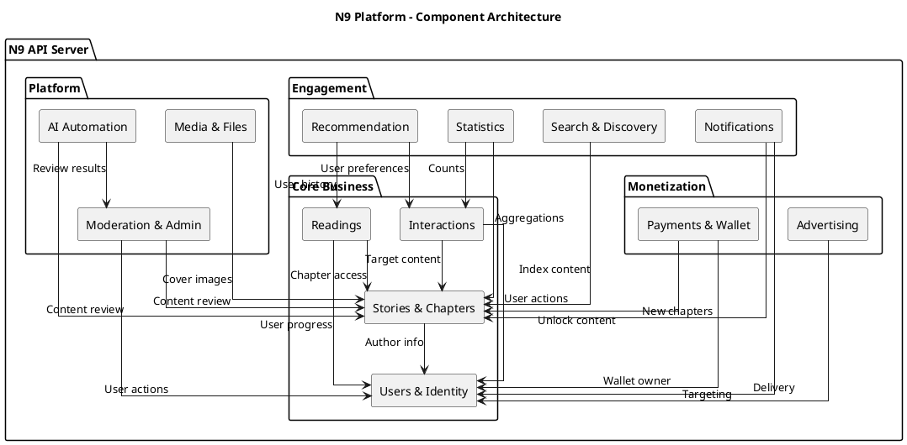
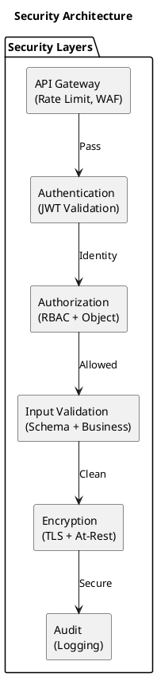
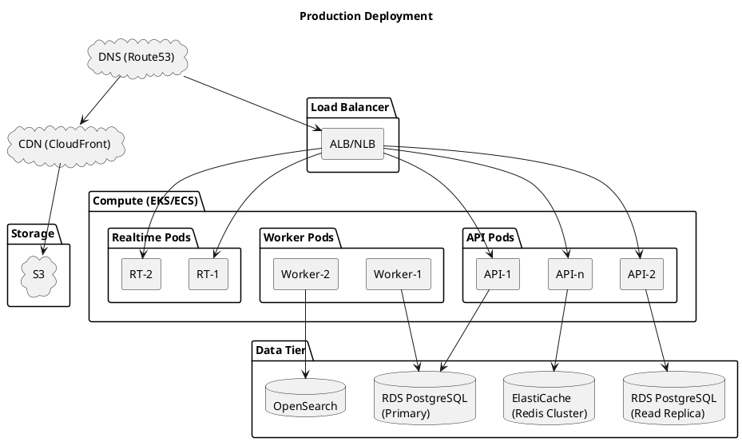
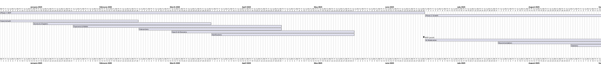

# System Overview (Target Architecture)

## 1. Document Information

| Attribute | Value |
|-----------|-------|
| Version | 2.0 |
| Last Updated | 2025-12-31 |
| Status | Approved |
| Owner | Architecture Team |
| Related | Design Components (01-13) |

---

## 2. Executive Summary

### 2.1 Purpose
**N9** is a comprehensive **story publishing and reading platform** that connects authors with readers through a monetized content ecosystem. The platform enables authors to publish serialized stories, readers to discover and consume content, and facilitates direct monetization through a virtual currency system.

### 2.2 Vision Statement
> Build the premier digital platform for serialized fiction that empowers authors to earn from their creativity while providing readers an engaging, personalized reading experience.

### 2.3 Business Objectives

| Objective | Success Metric | Target |
|-----------|----------------|--------|
| Author Monetization | Monthly author payouts | $100K+ by Year 2 |
| Reader Engagement | Daily Active Readers | 50K DAU |
| Content Growth | Published stories | 10K+ stories |
| Platform Revenue | Transaction fees + Ads | 15% of GMV |
| User Satisfaction | NPS Score | > 40 |

---

## 3. System Goals & Scope

### 3.1 Goals

| # | Goal | Priority |
|---|------|----------|
| G1 | Enable authors to publish stories with chapters, metadata, and pricing rules | P0 |
| G2 | Enable readers to discover, read, and interact with content | P0 |
| G3 | Provide secure wallet, payments, and payout workflows | P0 |
| G4 | Deliver near real-time notifications and counters | P1 |
| G5 | Automate content moderation with AI assistance | P1 |
| G6 | Provide personalized recommendations | P1 |
| G7 | Support multi-language content through translation | P2 |
| G8 | Enable advertising monetization | P2 |
| G9 | Operate reliably at scale with measurable SLOs | P0 |

### 3.2 Scope Definition

#### In Scope (MVP + Phase 1)

| Domain | Capabilities |
|--------|--------------|
| **Users & Identity** | Registration, OAuth, JWT auth, roles, sessions, profiles |
| **Stories & Chapters** | CRUD, versioning, state machine, pricing, visibility |
| **Interactions** | Follow, like, rate, review, comment, report |
| **Reading** | Progress tracking, sessions, bookmarks, library |
| **Search & Discovery** | Filtering, sorting, trending, browse surfaces |
| **Payments** | Wallet, coins, deposits, donations, unlocks |
| **Payouts** | Author earnings, withdrawal requests, approvals |
| **Notifications** | In-app, email, batching, preferences |
| **Statistics** | Views, rankings, author dashboards |
| **Moderation** | Reports, enforcements, appeals, content approval |
| **Media** | Image uploads, processing, CDN delivery |
| **Clients** | Web SPA, Mobile (iOS/Android), Admin portal |

#### In Scope (Phase 2+)

| Domain | Capabilities |
|--------|--------------|
| **AI Automation** | Content review, translation, quality assessment |
| **Recommendation** | Personalized, collaborative filtering, cold-start |
| **Advertising** | Banner management, campaigns, analytics |
| **Advanced Search** | Elasticsearch, autocomplete, semantic search |
| **Reading Goals** | Streaks, challenges, achievements |

#### Out of Scope

| Item | Rationale |
|------|-----------|
| Real-time collaborative editing | Not a core use case |
| Audio/video content | Text platform only |
| Social messaging/DMs | Use interactions instead |
| Third-party ad networks | Self-serve ads first |
| Cryptocurrency payments | Regulatory complexity |

---

## 4. Actors & Personas

### 4.1 Actor Overview



### 4.2 Actor Definitions

| Actor | Authentication | Description | Key Actions |
|-------|----------------|-------------|-------------|
| **Guest** | None | Unauthenticated visitor | Browse stories, view public chapters, search |
| **Reader** | Required | Registered user consuming content | Read, follow, like, review, comment, donate, unlock |
| **Author** | Required + Role | Content creator with publishing rights | Create/manage stories, set pricing, request payouts |
| **Moderator** | Required + Role | Policy enforcement staff | Review reports, approve content, issue warnings |
| **Admin** | Required + Role | System administrator | Full access, configuration, financial approvals |
| **Advertiser** | Required + Role | Ad campaign manager | Create campaigns, manage banners, view analytics |
| **System** | Service Account | Automated processes | Jobs, AI workers, reconciliation |

### 4.3 Reader Persona

> **"Alex the Avid Reader"**
> - Age: 25, urban professional
> - Reads 2-3 chapters daily during commute
> - Follows 10+ ongoing stories
> - Spends $20/month on coins
> - Values: Quick access, personalized recommendations, clean reading experience

### 4.4 Author Persona

> **"Sam the Serial Writer"**
> - Age: 32, part-time writer
> - Publishes 3 chapters/week
> - Earns supplemental income from platform
> - Values: Easy publishing, reader analytics, reliable payouts

---

## 5. Architecture Principles

### 5.1 Core Principles

| # | Principle | Rationale | Implications |
|---|-----------|-----------|--------------|
| AP1 | **Modular Monolith First** | Faster development, easier debugging | Clear module boundaries, prepare for extraction |
| AP2 | **Clean Architecture** | Separation of concerns, testability | Layers: Presentation → Application → Domain → Infrastructure |
| AP3 | **Event-Driven Async** | Decouple high-traffic features | Outbox pattern, eventual consistency for derived data |
| AP4 | **Data Integrity First** | Financial accuracy, auditability | Ledger-based accounting, idempotent operations |
| AP5 | **API-First Design** | Multi-client support, documentation | OpenAPI specs, versioned endpoints |
| AP6 | **Observability by Default** | Operational excellence | Structured logs, metrics, tracing, alerts |
| AP7 | **Security in Depth** | Protect user data, prevent fraud | Multiple security layers, principle of least privilege |
| AP8 | **Graceful Degradation** | Availability over completeness | Non-critical features fail independently |

### 5.2 Technology Choices

| Category | Choice | Version | Rationale |
|----------|--------|---------|-----------|
| **Language** | Java | 21 LTS | Performance, ecosystem, team expertise |
| **Framework** | Spring Boot | 3.2+ | Mature, comprehensive, community |
| **Database** | PostgreSQL | 16+ | ACID, JSONB, full-text search |
| **Cache** | Redis | 7+ | Performance, pub/sub, distributed locks |
| **Search** | Elasticsearch | 8+ | Full-text, aggregations, relevance |
| **Storage** | S3-Compatible | - | Scalable blob storage |
| **CDN** | CloudFront/Cloudflare | - | Global asset delivery |
| **Queue** | DB Outbox → Kafka | - | At-least-once, ordered delivery |
| **Realtime** | WebSocket/SSE | - | Push notifications |

---

## 6. System Context (C4 Level 1)

### 6.1 Context Diagram

```plantuml
@startuml
!include https://raw.githubusercontent.com/plantuml-stdlib/C4-PlantUML/master/C4_Context.puml

title N9 Platform - System Context Diagram

Person(guest, "Guest", "Browses public content")
Person(reader, "Reader", "Reads, interacts, pays")
Person(author, "Author", "Publishes stories")
Person(moderator, "Moderator", "Enforces policies")
Person(admin, "Admin", "Manages system")

System(n9, "N9 Platform", "Story publishing and reading platform with monetization")

System_Ext(payment, "Payment Gateway", "Processes payments (Stripe/PayPal)")
System_Ext(email, "Email Service", "Sends transactional emails (SendGrid)")
System_Ext(storage, "Object Storage", "Stores media files (S3)")
System_Ext(cdn, "CDN", "Delivers static assets globally")
System_Ext(ai, "AI Providers", "Content moderation, translation (OpenAI/Azure)")
System_Ext(push, "Push Service", "Mobile notifications (FCM/APNs)")

Rel(guest, n9, "Uses", "HTTPS")
Rel(reader, n9, "Uses", "HTTPS/WSS")
Rel(author, n9, "Uses", "HTTPS")
Rel(moderator, n9, "Uses", "HTTPS")
Rel(admin, n9, "Uses", "HTTPS")

Rel(n9, payment, "Processes payments", "HTTPS")
Rel(n9, email, "Sends emails", "HTTPS/SMTP")
Rel(n9, storage, "Stores/retrieves files", "HTTPS")
Rel(n9, cdn, "Serves assets", "HTTPS")
Rel(n9, ai, "AI processing", "HTTPS")
Rel(n9, push, "Push notifications", "HTTPS")
@enduml
```

### 6.2 External Dependencies

| System | Type | Protocol | Purpose | SLA Impact |
|--------|------|----------|---------|------------|
| **Payment Gateway** | Critical | HTTPS + Webhooks | Coin purchases, payouts | High - Blocks monetization |
| **Object Storage (S3)** | Critical | HTTPS | Media storage | High - Blocks uploads |
| **CDN** | Important | HTTPS | Asset delivery | Medium - Degraded UX |
| **Email Service** | Important | HTTPS/SMTP | Notifications, verification | Medium - Async |
| **AI Providers** | Important | HTTPS | Moderation, translation | Medium - Manual fallback |
| **Push Service** | Optional | HTTPS | Mobile notifications | Low - In-app fallback |

### 6.3 Dependency Failure Handling

| Dependency | Failure Mode | Detection | Fallback Strategy |
|------------|--------------|-----------|-------------------|
| Payment Gateway | Timeout/Error | Health check | Queue retries, notify user |
| Object Storage | Unavailable | Health check | Block uploads, serve cached |
| CDN | Degraded | Synthetic monitoring | Direct S3 fallback |
| Email Service | Rate limited | Response codes | Queue with backoff |
| AI Providers | Timeout/Outage | Circuit breaker | Queue for manual review |
| Push Service | Unavailable | Response codes | In-app only |

---

## 7. Container View (C4 Level 2)

### 7.1 Container Diagram



### 7.2 Container Descriptions

| Container | Technology | Purpose | Scaling |
|-----------|------------|---------|---------|
| **API Gateway** | Nginx/Kong | Rate limiting, SSL termination, routing | Horizontal |
| **N9 API Server** | Spring Boot | REST APIs, business logic, auth | Horizontal (stateless) |
| **N9 Worker** | Spring Boot | Async jobs, event processing | Horizontal (partitioned) |
| **Realtime Gateway** | Spring WebSocket | Push notifications to clients | Horizontal (sticky) |
| **PostgreSQL** | PostgreSQL 16 | Primary data store | Vertical + Read replicas |
| **Redis** | Redis 7 Cluster | Cache, sessions, pub/sub, locks | Clustered |
| **Elasticsearch** | ES 8 | Full-text search, analytics | Clustered |

### 7.3 API Server Responsibilities

```
┌─────────────────────────────────────────────────────────────┐
│                       N9 API Server                         │
├─────────────────────────────────────────────────────────────┤
│  Presentation Layer                                         │
│  ├── REST Controllers                                       │
│  ├── WebSocket Handlers                                     │
│  ├── Request/Response DTOs                                  │
│  └── Exception Handlers                                     │
├─────────────────────────────────────────────────────────────┤
│  Application Layer                                          │
│  ├── Use Case Services                                      │
│  ├── Command/Query Handlers                                 │
│  ├── Event Publishers                                       │
│  └── Transaction Management                                 │
├─────────────────────────────────────────────────────────────┤
│  Domain Layer                                               │
│  ├── Entities & Aggregates                                  │
│  ├── Value Objects                                          │
│  ├── Domain Services                                        │
│  └── Domain Events                                          │
├─────────────────────────────────────────────────────────────┤
│  Infrastructure Layer                                       │
│  ├── Repository Implementations                             │
│  ├── External Service Clients                               │
│  ├── Cache Implementations                                  │
│  └── Security Configurations                                │
└─────────────────────────────────────────────────────────────┘
```

---

## 8. Component Overview (C4 Level 3)

### 8.1 Component Map



### 8.2 Component Summary

| # | Component | Design Doc | Responsibilities | Data Owned |
|---|-----------|------------|------------------|------------|
| 01 | **Stories** | 01_STORIES_COMPONENT | Story/chapter CRUD, publishing, pricing | Story, Chapter, Category |
| 02 | **Users** | 02_USERS_COMPONENT | Auth, profiles, sessions, roles | Account, Session, Token |
| 03 | **Payments** | 03_PAYMENTS_COMPONENT | Wallet, transactions, payouts | Wallet, Transaction, Payout |
| 04 | **Interactions** | 04_INTERACTIONS_COMPONENT | Follow, like, review, comment, report | Follow, Like, Review, Comment |
| 05 | **Readings** | 05_READINGS_COMPONENT | Progress, sessions, bookmarks, library | ReadingProgress, Bookmark |
| 06 | **Search** | 06_SEARCH_COMPONENT | Discovery, filtering, trending | Search indexes |
| 07 | **Notifications** | 07_NOTIFICATIONS_COMPONENT | Multi-channel delivery, preferences | Notification, Preference |
| 08 | **Recommendation** | 08_RECOMMENDATION_COMPONENT | Personalized suggestions | UserVector, Similarity |
| 09 | **Statistics** | 09_STATISTICS_COMPONENT | Aggregations, rankings, dashboards | StoryStats, Rankings |
| 10 | **Moderation** | 10_MODERATION_ADMIN_COMPONENT | Reports, enforcements, approvals | Report, Enforcement, Appeal |
| 11 | **Media** | 11_MEDIA_FILES_COMPONENT | Uploads, processing, delivery | FileUpload, ImageVariant |
| 12 | **Advertising** | 12_ADVERTISING_COMPONENT | Banners, campaigns, tracking | Campaign, Banner, Impression |
| 13 | **AI Automation** | 13_AI_AUTOMATION_COMPONENT | Content review, translation | AiJob, Translation |

### 8.3 Component Interactions Matrix

| From \ To | Users | Stories | Pay | Interact | Read | Search | Notif | Recom | Stats | Mod | Media | Ads | AI |
|-----------|:-----:|:-------:|:---:|:--------:|:----:|:------:|:-----:|:-----:|:-----:|:---:|:-----:|:---:|:--:|
| **Users** | - | | | | | | | | | | | | |
| **Stories** | R | - | | | | | E | | E | | R | | E |
| **Payments** | R | R | - | | | | E | | | | | | |
| **Interactions** | R | R | | - | | | E | E | E | E | | | |
| **Readings** | R | R | | | - | | | E | E | | | | |
| **Search** | | R | | | | - | | | | | | | |
| **Notifications** | R | R | | | | | - | | | | | | |
| **Recommendation** | R | R | | R | R | | | - | | | | | |
| **Statistics** | | R | | R | R | | | | - | | | | |
| **Moderation** | R/W | R/W | | R | | | E | | | - | | | R |
| **Media** | R | | | | | | | | | | - | | |
| **Advertising** | R | | | | | | | | E | | R | - | |
| **AI** | | R | | | | | | | | W | | | - |

*Legend: R = Read, W = Write, E = Events*

---

## 9. Data Architecture

### 9.1 Data Store Responsibilities

| Store | Type | Purpose | Consistency |
|-------|------|---------|-------------|
| **PostgreSQL** | Primary | Source of truth for all entities | Strong (ACID) |
| **Redis** | Cache | Hot data, sessions, rate limits | Eventual |
| **Elasticsearch** | Search | Full-text search, analytics | Eventual |
| **S3** | Blob | Media files, exports | Eventual |

### 9.2 Data Ownership by Component

```
PostgreSQL
├── Users Module
│   ├── account
│   ├── user_session
│   ├── refresh_token
│   └── user_setting
├── Stories Module
│   ├── story
│   ├── chapter
│   ├── category
│   └── story_category
├── Payments Module
│   ├── wallet
│   ├── wallet_transaction
│   ├── payment
│   └── payout_request
├── Interactions Module
│   ├── follow
│   ├── story_like
│   ├── review
│   └── comment
├── Readings Module
│   ├── reading_progress
│   ├── reading_session
│   └── bookmark
├── Notifications Module
│   ├── notification
│   └── notification_preference
├── Statistics Module
│   ├── story_statistics
│   └── ranking_snapshot
├── Moderation Module
│   ├── content_report
│   ├── enforcement
│   └── appeal
├── Media Module
│   ├── file_upload
│   └── image_variant
├── Advertising Module
│   ├── campaign
│   ├── banner
│   └── banner_impression
└── AI Module
    ├── content_submission
    ├── ai_job
    └── translation_artifact
```

### 9.3 Key Data Invariants

| Domain | Invariant | Enforcement |
|--------|-----------|-------------|
| **Wallet** | Balance = SUM(credits) - SUM(debits) | Ledger pattern, triggers |
| **Payments** | Idempotent by key | Unique constraint |
| **Payouts** | Cannot exceed available balance | Check constraint |
| **Stories** | Published requires approval | State machine |
| **Chapters** | Index unique per story | Unique constraint |
| **Follows** | One per user-story pair | Unique constraint |
| **Reviews** | One per user-story pair | Unique constraint |

---

## 10. Cross-Cutting Concerns

### 10.1 Security Architecture



| Layer | Implementation |
|-------|----------------|
| **Transport** | TLS 1.3, HSTS |
| **Authentication** | JWT RS256, refresh rotation |
| **Authorization** | RBAC roles, object-level checks |
| **Input Validation** | Schema validation, sanitization |
| **Data Protection** | Encryption at rest, PII masking |
| **Audit** | All mutations logged |

### 10.2 Observability Stack

| Pillar | Tool | Purpose |
|--------|------|---------|
| **Logs** | JSON structured → ELK | Request tracing, debugging |
| **Metrics** | Prometheus + Grafana | SLO monitoring, alerting |
| **Traces** | OpenTelemetry + Jaeger | Distributed tracing |
| **Alerts** | PagerDuty/OpsGenie | Incident response |

### 10.3 Quality Attributes Summary

| Attribute | Target | Measurement |
|-----------|--------|-------------|
| **Availability** | 99.9% monthly | Uptime monitoring |
| **Latency (Read)** | p95 < 400ms | APM metrics |
| **Latency (Write)** | p95 < 600ms | APM metrics |
| **Throughput** | 2,000 req/s peak | Load testing |
| **Scalability** | 10x growth headroom | Capacity planning |
| **Recoverability** | RPO 15min, RTO 60min | DR drills |

---

## 11. Deployment Architecture

### 11.1 Target Environment



### 11.2 Environment Tiers

| Environment | Purpose | Scale | Data |
|-------------|---------|-------|------|
| **Local** | Development | Single instance | H2/Docker |
| **Dev** | Integration | 1 pod each | Shared DB |
| **Staging** | Pre-production | 2 pods each | Anonymized prod |
| **Production** | Live | Auto-scaled | Live data |

### 11.3 Deployment Strategy

| Aspect | Approach |
|--------|----------|
| **Application** | Blue/green deployments |
| **Database** | Forward-only migrations |
| **Configuration** | Environment variables + secrets manager |
| **Rollback** | Instant traffic switch |

---

## 12. Release Roadmap

### 12.1 Phase Overview



### 12.2 Phase Details

| Phase | Components | Key Milestones |
|-------|------------|----------------|
| **Phase 1: MVP** | Users, Stories, Payments, Interactions, Search, Notifications | Core platform launch |
| **Phase 2: Growth** | AI, Recommendation, Statistics, Advertising, Readings | Monetization + engagement |
| **Phase 3: Scale** | Translation, Advanced Search, Performance | Global expansion |

---

## 13. Decision Log

### 13.1 Key Architecture Decisions

| ID | Decision | Rationale | Date |
|----|----------|-----------|------|
| ADR-001 | Modular monolith over microservices | Faster development, team size | 2024-Q4 |
| ADR-002 | PostgreSQL as primary database | ACID, JSONB, full-text | 2024-Q4 |
| ADR-003 | JWT RS256 for authentication | Stateless, verifiable | 2024-Q4 |
| ADR-004 | Outbox pattern for events | Consistency + async | 2025-Q1 |
| ADR-005 | Redis for caching and sessions | Performance, features | 2025-Q1 |
| ADR-006 | S3 + CDN for media | Scalability, cost | 2025-Q1 |
| ADR-007 | Virtual currency (Coins) | Flexibility, engagement | 2025-Q1 |

---

## 14. References

### 14.1 Design Documents
- [01_STORIES_COMPONENT.md](../Design/Components/01_STORIES_COMPONENT.md)
- [02_USERS_COMPONENT.md](../Design/Components/02_USERS_COMPONENT.md)
- [03_PAYMENTS_COMPONENT.md](../Design/Components/03_PAYMENTS_COMPONENT.md)
- [04_INTERACTIONS_COMPONENT.md](../Design/Components/04_INTERACTIONS_COMPONENT.md)
- [05_READINGS_COMPONENT.md](../Design/Components/05_READINGS_COMPONENT.md)
- [06_SEARCH_COMPONENT.md](../Design/Components/06_SEARCH_COMPONENT.md)
- [07_NOTIFICATIONS_COMPONENT.md](../Design/Components/07_NOTIFICATIONS_COMPONENT.md)
- [08_RECOMMENDATION_COMPONENT.md](../Design/Components/08_RECOMMENDATION_COMPONENT.md)
- [09_STATISTICS_COMPONENT.md](../Design/Components/09_STATISTICS_COMPONENT.md)
- [10_MODERATION_ADMIN_COMPONENT.md](../Design/Components/10_MODERATION_ADMIN_COMPONENT.md)
- [11_MEDIA_FILES_COMPONENT.md](../Design/Components/11_MEDIA_FILES_COMPONENT.md)
- [12_ADVERTISING_COMPONENT.md](../Design/Components/12_ADVERTISING_COMPONENT.md)
- [13_AI_AUTOMATION_COMPONENT.md](../Design/Components/13_AI_AUTOMATION_COMPONENT.md)

### 14.2 Specification Documents
- [02_DATABASE_SCHEMA.md](02_DATABASE_SCHEMA.md)
- [03_NON_FUNCTIONAL_REQUIREMENTS.md](03_NON_FUNCTIONAL_REQUIREMENTS.md)
- [04_FUNCTIONAL_REQUIREMENTS.md](04_FUNCTIONAL_REQUIREMENTS.md)
- [08_API_STANDARDS.md](08_API_STANDARDS.md)

### 14.3 External References
- [C4 Model](https://c4model.com/)
- [arc42 Template](https://arc42.org/)
- [OpenAPI Specification](https://swagger.io/specification/)
