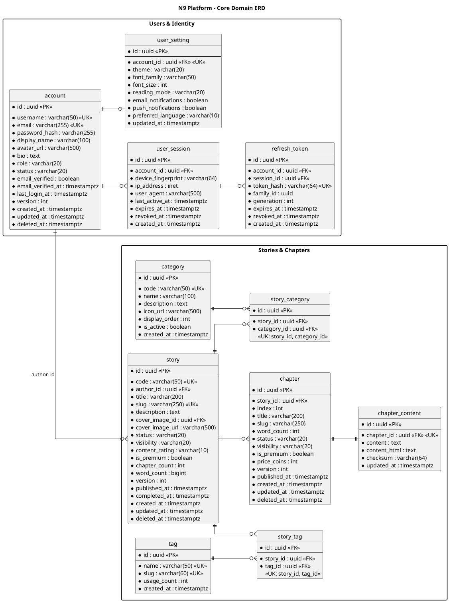
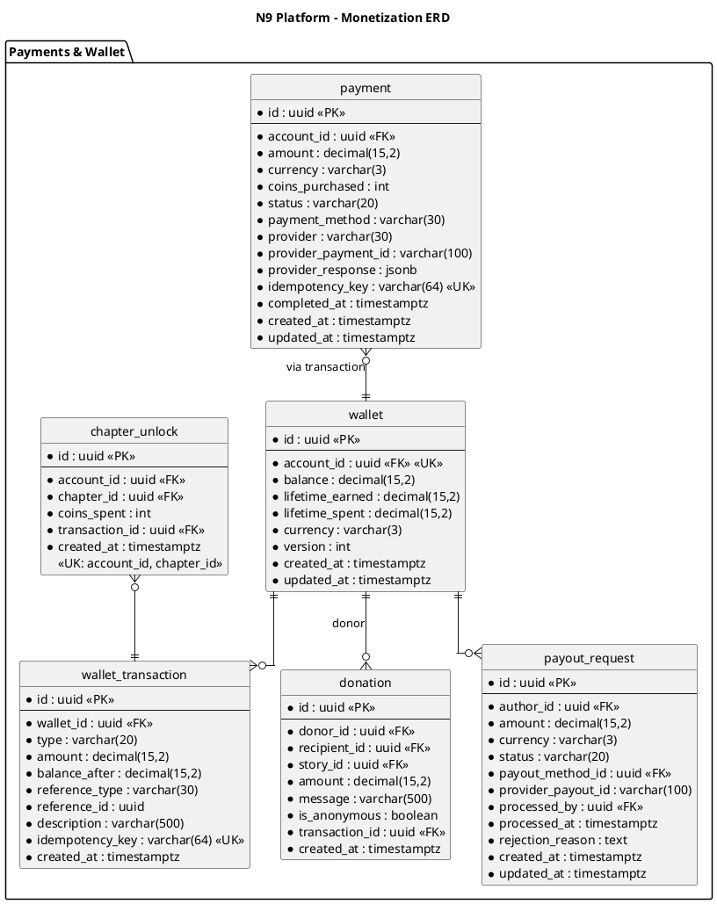
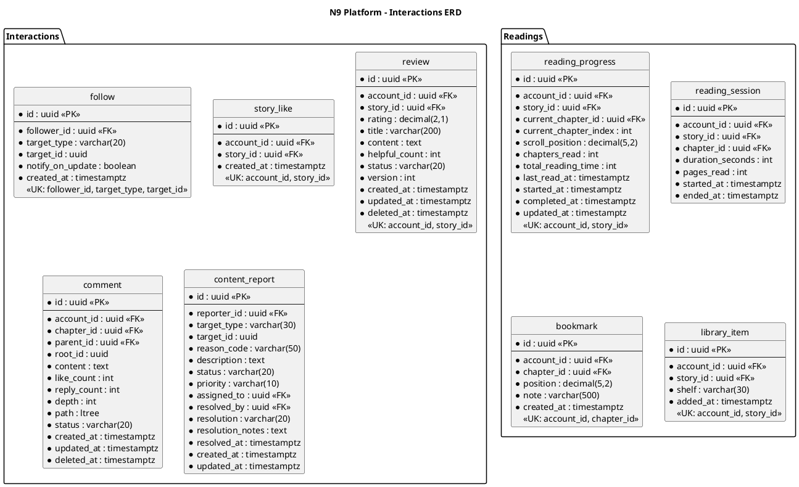
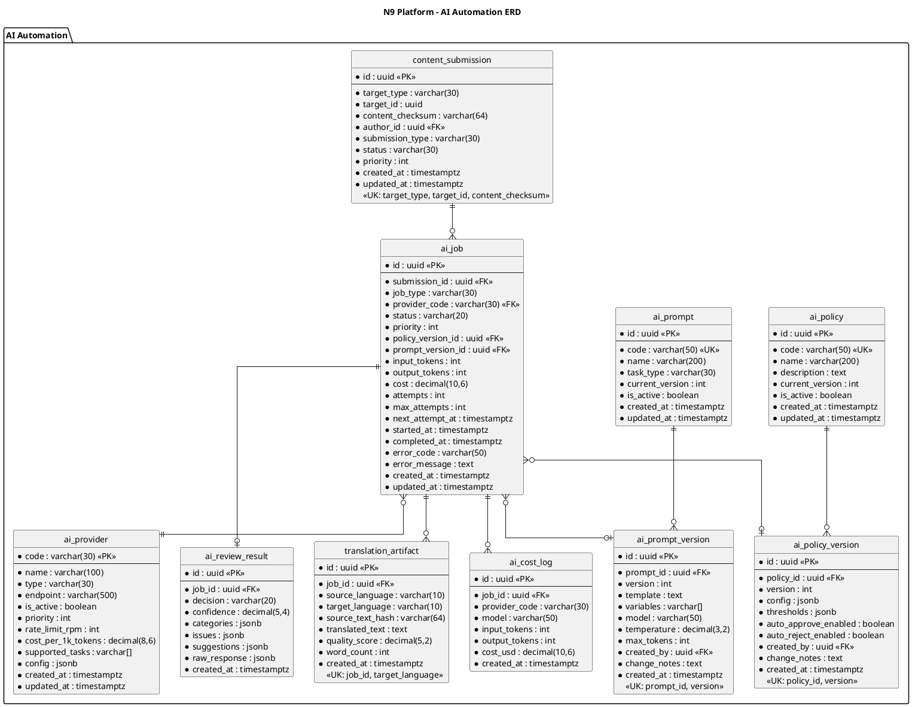
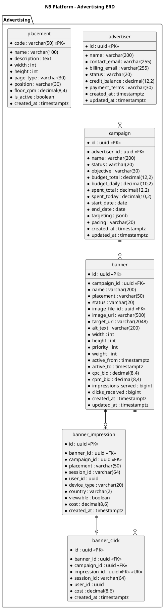

# Database Schema Specification

## 1. Document Information

| Attribute | Value |
|-----------|-------|
| Version | 2.0 |
| Last Updated | 2025-12-31 |
| Status | Approved |
| Owner | Data Architecture Team |
| Database | PostgreSQL 16+ |

---

## 2. Overview

### 2.1 Purpose
This document defines the **complete data model** for the N9 platform, including all entities, relationships, constraints, indexes, and data governance rules aligned with the 13 component design documents.

### 2.2 Design Principles

| Principle | Implementation |
|-----------|----------------|
| **Normalization** | 3NF for transactional tables, denormalization for read-heavy views |
| **Soft Delete** | `deleted_at` timestamp for recoverable entities |
| **Audit Trail** | `created_at`, `updated_at`, `created_by`, `updated_by` on all entities |
| **UUID Primary Keys** | Globally unique, non-sequential identifiers |
| **Optimistic Locking** | `version` column for concurrent updates |
| **Time Zone** | All timestamps in `TIMESTAMPTZ` (UTC storage) |

### 2.3 Naming Conventions

| Element | Convention | Example |
|---------|------------|---------|
| Tables | `snake_case`, singular | `story`, `user_wallet` |
| Columns | `snake_case` | `created_at`, `story_id` |
| Primary Keys | `id` | `id UUID PRIMARY KEY` |
| Foreign Keys | `{table}_id` | `story_id`, `author_id` |
| Indexes | `idx_{table}_{columns}` | `idx_story_status_created` |
| Constraints | `{table}_{type}_{columns}` | `story_uk_code`, `chapter_fk_story` |

---

## 3. Schema Organization

### 3.1 Schema by Component

| Schema | Component | Tables |
|--------|-----------|--------|
| `public` | Core | All tables (single schema for monolith) |

### 3.2 Table Ownership by Component

```
├── Users & Identity (02_USERS_COMPONENT)
│   ├── account
│   ├── role
│   ├── permission
│   ├── user_permission
│   ├── user_session
│   ├── refresh_token
│   ├── user_setting
│   ├── user_profile
│   └── password_reset_token
│
├── Stories & Chapters (01_STORIES_COMPONENT)
│   ├── story
│   ├── chapter
│   ├── chapter_content
│   ├── category
│   ├── story_category
│   ├── tag
│   ├── story_tag
│   ├── story_pricing
│   └── chapter_unlock
│
├── Payments & Wallet (03_PAYMENTS_COMPONENT)
│   ├── wallet
│   ├── wallet_transaction
│   ├── coin_package
│   ├── payment
│   ├── payment_method
│   ├── donation
│   ├── payout_request
│   ├── payout_method
│   └── discount_code
│
├── Interactions (04_INTERACTIONS_COMPONENT)
│   ├── follow
│   ├── story_like
│   ├── chapter_like
│   ├── review
│   ├── comment
│   ├── comment_like
│   └── content_report
│
├── Readings (05_READINGS_COMPONENT)
│   ├── reading_progress
│   ├── reading_session
│   ├── bookmark
│   ├── reading_goal
│   ├── reading_streak
│   └── library_item
│
├── Search & Discovery (06_SEARCH_COMPONENT)
│   ├── search_history
│   └── trending_cache
│
├── Notifications (07_NOTIFICATIONS_COMPONENT)
│   ├── notification
│   ├── notification_preference
│   └── notification_batch
│
├── Recommendation (08_RECOMMENDATION_COMPONENT)
│   ├── user_interest
│   ├── story_similarity
│   └── recommendation_log
│
├── Statistics (09_STATISTICS_COMPONENT)
│   ├── story_statistics
│   ├── chapter_statistics
│   ├── author_statistics
│   ├── ranking_snapshot
│   └── daily_aggregation
│
├── Moderation & Admin (10_MODERATION_ADMIN_COMPONENT)
│   ├── enforcement
│   ├── appeal
│   ├── audit_log
│   └── system_config
│
├── Media & Files (11_MEDIA_FILES_COMPONENT)
│   ├── file_upload
│   ├── image_variant
│   └── upload_quota
│
├── Advertising (12_ADVERTISING_COMPONENT)
│   ├── advertiser
│   ├── campaign
│   ├── banner
│   ├── placement
│   ├── banner_impression
│   ├── banner_click
│   └── frequency_cap
│
└── AI Automation (13_AI_AUTOMATION_COMPONENT)
    ├── ai_provider
    ├── ai_policy
    ├── ai_policy_version
    ├── ai_prompt
    ├── ai_prompt_version
    ├── content_submission
    ├── ai_job
    ├── ai_review_result
    ├── translation_artifact
    └── ai_cost_log
```

---

## 4. Complete Entity Relationship Diagram

### 4.1 Core Domain ERD



### 4.2 Monetization ERD



### 4.3 Interactions & Engagement ERD



### 4.4 Platform Services ERD

```plantuml
@startuml
skinparam linetype ortho
hide circle

title N9 Platform - Services ERD

package "Notifications" {
  entity notification {
    * id : uuid <<PK>>
    --
    * account_id : uuid <<FK>>
    * type : varchar(50)
    * title : varchar(200)
    * body : text
    * data : jsonb
    * channel : varchar(20)
    * is_read : boolean
    * read_at : timestamptz
    * sent_at : timestamptz
    * created_at : timestamptz
  }
  
  entity notification_preference {
    * id : uuid <<PK>>
    --
    * account_id : uuid <<FK>>
    * notification_type : varchar(50)
    * channel : varchar(20)
    * enabled : boolean
    * updated_at : timestamptz
    <<UK: account_id, notification_type, channel>>
  }
}

package "Statistics" {
  entity story_statistics {
    * id : uuid <<PK>>
    --
    * story_id : uuid <<FK>> <<UK>>
    * view_count : bigint
    * unique_readers : bigint
    * like_count : bigint
    * follow_count : bigint
    * review_count : int
    * comment_count : bigint
    * avg_rating : decimal(3,2)
    * total_reading_time : bigint
    * revenue_total : decimal(15,2)
    * updated_at : timestamptz
  }
  
  entity ranking_snapshot {
    * id : uuid <<PK>>
    --
    * ranking_type : varchar(30)
    * period : varchar(20)
    * period_start : date
    * story_id : uuid <<FK>>
    * rank : int
    * score : decimal(15,4)
    * previous_rank : int
    * created_at : timestamptz
    <<UK: ranking_type, period, period_start, story_id>>
  }
  
  entity daily_aggregation {
    * id : uuid <<PK>>
    --
    * date : date
    * story_id : uuid <<FK>>
    * views : bigint
    * unique_readers : int
    * likes : int
    * follows : int
    * comments : int
    * revenue : decimal(15,2)
    <<UK: date, story_id>>
  }
}

package "Media & Files" {
  entity file_upload {
    * id : uuid <<PK>>
    --
    * uploader_id : uuid <<FK>>
    * purpose : varchar(30)
    * original_name : varchar(255)
    * storage_key : varchar(500)
    * content_type : varchar(100)
    * size_bytes : bigint
    * checksum : varchar(64)
    * status : varchar(20)
    * metadata : jsonb
    * expires_at : timestamptz
    * created_at : timestamptz
  }
  
  entity image_variant {
    * id : uuid <<PK>>
    --
    * source_file_id : uuid <<FK>>
    * variant_type : varchar(30)
    * width : int
    * height : int
    * format : varchar(10)
    * storage_key : varchar(500)
    * cdn_url : varchar(500)
    * size_bytes : int
    * created_at : timestamptz
  }
}

package "Moderation & Admin" {
  entity enforcement {
    * id : uuid <<PK>>
    --
    * report_id : uuid <<FK>>
    * target_type : varchar(30)
    * target_id : uuid
    * action : varchar(30)
    * reason_code : varchar(50)
    * notes : text
    * duration_hours : int
    * expires_at : timestamptz
    * enforced_by : uuid <<FK>>
    * reversed_by : uuid <<FK>>
    * reversed_at : timestamptz
    * created_at : timestamptz
  }
  
  entity appeal {
    * id : uuid <<PK>>
    --
    * enforcement_id : uuid <<FK>>
    * appellant_id : uuid <<FK>>
    * reason : text
    * evidence : text
    * status : varchar(20)
    * decision : varchar(20)
    * decision_notes : text
    * decided_by : uuid <<FK>>
    * decided_at : timestamptz
    * created_at : timestamptz
  }
  
  entity audit_log {
    * id : uuid <<PK>>
    --
    * actor_id : uuid <<FK>>
    * actor_type : varchar(20)
    * action : varchar(50)
    * target_type : varchar(30)
    * target_id : uuid
    * changes : jsonb
    * ip_address : inet
    * user_agent : varchar(500)
    * request_id : varchar(64)
    * created_at : timestamptz
  }
}

@enduml
```



### 4.5 AI Automation ERD



### 4.6 Advertising ERD



---

## 5. Table Specifications

### 5.1 Users & Identity Tables

#### `account`
Primary user identity table.

| Column | Type | Nullable | Default | Description |
|--------|------|----------|---------|-------------|
| `id` | uuid | NO | gen_random_uuid() | Primary key |
| `username` | varchar(50) | NO | | Unique login name |
| `email` | varchar(255) | NO | | Unique email address |
| `password_hash` | varchar(255) | NO | | BCrypt hash |
| `display_name` | varchar(100) | YES | | Public display name |
| `avatar_url` | varchar(500) | YES | | Profile image URL |
| `bio` | text | YES | | User biography |
| `role` | varchar(20) | NO | 'USER' | USER, AUTHOR, MODERATOR, ADMIN |
| `status` | varchar(20) | NO | 'ACTIVE' | ACTIVE, SUSPENDED, BANNED, DELETED |
| `email_verified` | boolean | NO | false | Email verification status |
| `email_verified_at` | timestamptz | YES | | Verification timestamp |
| `last_login_at` | timestamptz | YES | | Last successful login |
| `version` | int | NO | 1 | Optimistic lock version |
| `created_at` | timestamptz | NO | now() | Creation timestamp |
| `updated_at` | timestamptz | NO | now() | Last update timestamp |
| `deleted_at` | timestamptz | YES | | Soft delete timestamp |

**Indexes:**
```sql
CREATE UNIQUE INDEX account_uk_username ON account(username) WHERE deleted_at IS NULL;
CREATE UNIQUE INDEX account_uk_email ON account(email) WHERE deleted_at IS NULL;
CREATE INDEX idx_account_role_status ON account(role, status);
CREATE INDEX idx_account_created ON account(created_at);
```

#### `wallet`
User coin balance and ledger summary.

| Column | Type | Nullable | Default | Description |
|--------|------|----------|---------|-------------|
| `id` | uuid | NO | gen_random_uuid() | Primary key |
| `account_id` | uuid | NO | | Owner account (unique) |
| `balance` | decimal(15,2) | NO | 0.00 | Current coin balance |
| `lifetime_earned` | decimal(15,2) | NO | 0.00 | Total coins earned |
| `lifetime_spent` | decimal(15,2) | NO | 0.00 | Total coins spent |
| `currency` | varchar(3) | NO | 'COIN' | Currency type |
| `version` | int | NO | 1 | Optimistic lock |
| `created_at` | timestamptz | NO | now() | |
| `updated_at` | timestamptz | NO | now() | |

**Constraints:**
```sql
ALTER TABLE wallet ADD CONSTRAINT wallet_balance_non_negative CHECK (balance >= 0);
ALTER TABLE wallet ADD CONSTRAINT wallet_uk_account UNIQUE (account_id);
```

#### `wallet_transaction`
Immutable ledger of all balance changes.

| Column | Type | Nullable | Default | Description |
|--------|------|----------|---------|-------------|
| `id` | uuid | NO | gen_random_uuid() | Primary key |
| `wallet_id` | uuid | NO | | Target wallet |
| `type` | varchar(20) | NO | | CREDIT, DEBIT |
| `amount` | decimal(15,2) | NO | | Transaction amount |
| `balance_after` | decimal(15,2) | NO | | Balance after tx |
| `reference_type` | varchar(30) | NO | | PAYMENT, DONATION, UNLOCK, PAYOUT, etc. |
| `reference_id` | uuid | YES | | Related entity ID |
| `description` | varchar(500) | YES | | Human-readable description |
| `idempotency_key` | varchar(64) | NO | | Unique idempotency key |
| `created_at` | timestamptz | NO | now() | Immutable |

**Indexes:**
```sql
CREATE UNIQUE INDEX wallet_tx_uk_idempotency ON wallet_transaction(idempotency_key);
CREATE INDEX idx_wallet_tx_wallet ON wallet_transaction(wallet_id, created_at DESC);
CREATE INDEX idx_wallet_tx_reference ON wallet_transaction(reference_type, reference_id);
```

### 5.2 Stories & Chapters Tables

#### `story`
Core story entity.

| Column | Type | Nullable | Default | Description |
|--------|------|----------|---------|-------------|
| `id` | uuid | NO | gen_random_uuid() | Primary key |
| `code` | varchar(50) | NO | | Unique story code |
| `author_id` | uuid | NO | | Author account FK |
| `title` | varchar(200) | NO | | Story title |
| `slug` | varchar(250) | NO | | URL-friendly slug |
| `description` | text | YES | | Synopsis |
| `cover_image_id` | uuid | YES | | Cover file FK |
| `cover_image_url` | varchar(500) | YES | | CDN URL (denormalized) |
| `status` | varchar(20) | NO | 'DRAFT' | DRAFT, ONGOING, COMPLETED, HIATUS |
| `visibility` | varchar(20) | NO | 'PRIVATE' | PRIVATE, PENDING, VISIBLE, HIDDEN |
| `content_rating` | varchar(10) | NO | 'GENERAL' | GENERAL, TEEN, MATURE |
| `is_premium` | boolean | NO | false | Has premium chapters |
| `chapter_count` | int | NO | 0 | Denormalized count |
| `word_count` | bigint | NO | 0 | Total word count |
| `version` | int | NO | 1 | Optimistic lock |
| `published_at` | timestamptz | YES | | First publish date |
| `completed_at` | timestamptz | YES | | Completion date |
| `created_at` | timestamptz | NO | now() | |
| `updated_at` | timestamptz | NO | now() | |
| `deleted_at` | timestamptz | YES | | Soft delete |

**Indexes:**
```sql
CREATE UNIQUE INDEX story_uk_code ON story(code);
CREATE UNIQUE INDEX story_uk_slug ON story(slug) WHERE deleted_at IS NULL;
CREATE INDEX idx_story_author ON story(author_id);
CREATE INDEX idx_story_browse ON story(visibility, status, updated_at DESC) WHERE deleted_at IS NULL;
CREATE INDEX idx_story_search ON story USING gin(to_tsvector('english', title || ' ' || COALESCE(description, '')));
```

#### `chapter`
Individual chapter metadata.

| Column | Type | Nullable | Default | Description |
|--------|------|----------|---------|-------------|
| `id` | uuid | NO | gen_random_uuid() | Primary key |
| `story_id` | uuid | NO | | Parent story FK |
| `index` | int | NO | | Chapter order (1-based) |
| `title` | varchar(200) | NO | | Chapter title |
| `slug` | varchar(250) | NO | | URL slug |
| `word_count` | int | NO | 0 | Word count |
| `status` | varchar(20) | NO | 'DRAFT' | DRAFT, PUBLISHED, SCHEDULED |
| `visibility` | varchar(20) | NO | 'PRIVATE' | PRIVATE, PENDING, VISIBLE |
| `is_premium` | boolean | NO | false | Requires unlock |
| `price_coins` | int | NO | 0 | Unlock price |
| `version` | int | NO | 1 | Optimistic lock |
| `published_at` | timestamptz | YES | | Publish timestamp |
| `created_at` | timestamptz | NO | now() | |
| `updated_at` | timestamptz | NO | now() | |
| `deleted_at` | timestamptz | YES | | Soft delete |

**Constraints & Indexes:**
```sql
ALTER TABLE chapter ADD CONSTRAINT chapter_uk_story_index 
  UNIQUE (story_id, index) WHERE deleted_at IS NULL;
CREATE INDEX idx_chapter_story_order ON chapter(story_id, index) WHERE deleted_at IS NULL;
CREATE INDEX idx_chapter_visibility ON chapter(story_id, visibility, status);
```

---

## 6. Indexing Strategy

### 6.1 Index Categories

| Category | Purpose | Examples |
|----------|---------|----------|
| **Primary** | Row lookup | `id` columns |
| **Unique** | Constraint + lookup | `username`, `email`, `slug` |
| **Foreign Key** | Join performance | `*_id` columns |
| **Composite** | Multi-column queries | `(status, created_at)` |
| **Covering** | Index-only scans | Include frequently selected columns |
| **Partial** | Filtered queries | `WHERE deleted_at IS NULL` |
| **GIN** | Full-text search | `to_tsvector()` columns |

### 6.2 Critical Path Indexes

| Query Pattern | Table | Index |
|---------------|-------|-------|
| Story browse by status | `story` | `idx_story_browse` |
| Chapter list by story | `chapter` | `idx_chapter_story_order` |
| User wallet lookup | `wallet` | `wallet_uk_account` |
| Reading progress | `reading_progress` | `(account_id, story_id)` |
| Notification inbox | `notification` | `(account_id, is_read, created_at)` |
| AI job claiming | `ai_job` | `(status, next_attempt_at)` |
| Report queue | `content_report` | `(status, priority, created_at)` |

### 6.3 Index Maintenance

```sql
-- Analyze query patterns weekly
SELECT 
  schemaname, tablename, indexname,
  idx_scan, idx_tup_read, idx_tup_fetch
FROM pg_stat_user_indexes
ORDER BY idx_scan DESC;

-- Find unused indexes
SELECT 
  schemaname, tablename, indexname
FROM pg_stat_user_indexes
WHERE idx_scan = 0 
  AND indexname NOT LIKE '%_pkey'
  AND indexname NOT LIKE '%_uk_%';
```

---

## 7. Partitioning Strategy

### 7.1 Partition Candidates

| Table | Partition Key | Strategy | Threshold |
|-------|---------------|----------|-----------|
| `banner_impression` | `created_at` | Monthly | 10M rows |
| `banner_click` | `created_at` | Monthly | 1M rows |
| `notification` | `created_at` | Monthly | 50M rows |
| `audit_log` | `created_at` | Monthly | 10M rows |
| `reading_session` | `started_at` | Monthly | 100M rows |
| `daily_aggregation` | `date` | Monthly | N/A |
| `ai_cost_log` | `created_at` | Monthly | 10M rows |

### 7.2 Partition Implementation Example

```sql
-- Create partitioned table
CREATE TABLE banner_impression (
  id uuid NOT NULL,
  banner_id uuid NOT NULL,
  campaign_id uuid NOT NULL,
  created_at timestamptz NOT NULL,
  -- ... other columns
  PRIMARY KEY (id, created_at)
) PARTITION BY RANGE (created_at);

-- Create monthly partitions
CREATE TABLE banner_impression_2025_12
  PARTITION OF banner_impression
  FOR VALUES FROM ('2025-12-01') TO ('2026-01-01');

CREATE TABLE banner_impression_2026_01
  PARTITION OF banner_impression
  FOR VALUES FROM ('2026-01-01') TO ('2026-02-01');

-- Automate partition creation
CREATE OR REPLACE FUNCTION create_monthly_partition(
  p_table TEXT,
  p_year INT,
  p_month INT
) RETURNS VOID AS $$
DECLARE
  v_partition TEXT;
  v_start DATE;
  v_end DATE;
BEGIN
  v_partition := format('%s_%s_%s', p_table, p_year, LPAD(p_month::TEXT, 2, '0'));
  v_start := make_date(p_year, p_month, 1);
  v_end := v_start + INTERVAL '1 month';
  
  EXECUTE format(
    'CREATE TABLE IF NOT EXISTS %I PARTITION OF %I FOR VALUES FROM (%L) TO (%L)',
    v_partition, p_table, v_start, v_end
  );
END;
$$ LANGUAGE plpgsql;
```

---

## 8. Data Retention & Archival

### 8.1 Retention Policies

| Data Category | Retention | Action |
|---------------|-----------|--------|
| **User accounts** | Indefinite (soft delete) | Archive after 7 years inactive |
| **Stories/chapters** | Indefinite (soft delete) | Archive deleted after 90 days |
| **Wallet transactions** | 7 years | Required for audit |
| **Payment records** | 7 years | Required for compliance |
| **Reading sessions** | 2 years | Aggregate then purge |
| **Notifications** | 90 days | Hard delete |
| **Ad impressions** | 90 days raw | Aggregate then purge |
| **Audit logs** | 3 years | Archive to cold storage |
| **AI job results** | 90 days | Archive raw responses |
| **Search history** | 30 days | Hard delete |

### 8.2 Archival Process

```sql
-- Archive old notifications
INSERT INTO notification_archive
SELECT * FROM notification
WHERE created_at < NOW() - INTERVAL '90 days';

DELETE FROM notification
WHERE created_at < NOW() - INTERVAL '90 days';

-- Aggregate and purge reading sessions
INSERT INTO reading_session_daily (account_id, story_id, date, total_duration, session_count)
SELECT 
  account_id, story_id, 
  started_at::date,
  SUM(duration_seconds),
  COUNT(*)
FROM reading_session
WHERE started_at < NOW() - INTERVAL '2 years'
GROUP BY account_id, story_id, started_at::date
ON CONFLICT (account_id, story_id, date) DO UPDATE
SET total_duration = reading_session_daily.total_duration + EXCLUDED.total_duration,
    session_count = reading_session_daily.session_count + EXCLUDED.session_count;

DELETE FROM reading_session
WHERE started_at < NOW() - INTERVAL '2 years';
```

---

## 9. Constraints & Invariants

### 9.1 Critical Business Rules

| Domain | Rule | Enforcement |
|--------|------|-------------|
| **Wallet** | Balance never negative | `CHECK (balance >= 0)` |
| **Wallet** | Balance = Σ credits - Σ debits | Trigger validation |
| **Payment** | Idempotent by key | `UNIQUE (idempotency_key)` |
| **Payout** | Cannot exceed available balance | Application + trigger |
| **Chapter** | Index unique per story | `UNIQUE (story_id, index)` |
| **Follow** | One per user-target | `UNIQUE (follower_id, target_type, target_id)` |
| **Review** | One per user-story | `UNIQUE (account_id, story_id)` |
| **Unlock** | One per user-chapter | `UNIQUE (account_id, chapter_id)` |
| **Policy** | Versions immutable | Application-level |

### 9.2 Referential Integrity

```sql
-- Cascade soft deletes for story -> chapters
CREATE OR REPLACE FUNCTION cascade_story_soft_delete()
RETURNS TRIGGER AS $$
BEGIN
  IF NEW.deleted_at IS NOT NULL AND OLD.deleted_at IS NULL THEN
    UPDATE chapter SET deleted_at = NEW.deleted_at
    WHERE story_id = NEW.id AND deleted_at IS NULL;
  END IF;
  RETURN NEW;
END;
$$ LANGUAGE plpgsql;

CREATE TRIGGER trg_story_soft_delete
AFTER UPDATE ON story
FOR EACH ROW
WHEN (NEW.deleted_at IS DISTINCT FROM OLD.deleted_at)
EXECUTE FUNCTION cascade_story_soft_delete();
```

---

## 10. Migration Strategy

### 10.1 Migration Principles

| Principle | Implementation |
|-----------|----------------|
| **Forward-only** | No down migrations in production |
| **Backward-compatible** | Expand-contract pattern |
| **Automated** | Flyway/Liquibase managed |
| **Reversible schema** | Add nullable columns first |
| **Data migrations separate** | Scripts, not DDL |

### 10.2 Migration Workflow

```
1. Create migration file: V{version}__{description}.sql
2. Test on local database
3. Apply to dev environment
4. Review execution plan
5. Apply to staging with prod-like data
6. Performance validation
7. Apply to production during maintenance window
```

### 10.3 Example Migration

```sql
-- V20251231_001__add_story_visibility.sql

-- Step 1: Add nullable column (backward compatible)
ALTER TABLE story ADD COLUMN IF NOT EXISTS visibility VARCHAR(20);

-- Step 2: Backfill data
UPDATE story 
SET visibility = CASE 
  WHEN status = 'PUBLISHED' THEN 'VISIBLE'
  WHEN status = 'DRAFT' THEN 'PRIVATE'
  ELSE 'PENDING'
END
WHERE visibility IS NULL;

-- Step 3: Add constraint (after backfill complete)
-- Run in separate migration after validation
ALTER TABLE story ALTER COLUMN visibility SET NOT NULL;
ALTER TABLE story ALTER COLUMN visibility SET DEFAULT 'PRIVATE';
```

---

## 11. Performance Considerations

### 11.1 Query Budgets

| Query Type | Target p95 | Max DB Round-trips |
|------------|------------|-------------------|
| Simple lookup | < 10ms | 1 |
| Browse/list | < 50ms | 1-2 |
| Complex aggregation | < 200ms | 1 |
| Report generation | < 5s | N/A (async) |

### 11.2 Connection Pooling

```yaml
# HikariCP configuration
spring:
  datasource:
    hikari:
      minimum-idle: 10
      maximum-pool-size: 50
      connection-timeout: 30000
      idle-timeout: 600000
      max-lifetime: 1800000
```

### 11.3 Query Optimization Tips

```sql
-- Use covering indexes for hot queries
CREATE INDEX idx_story_browse_covering 
ON story(visibility, status, updated_at DESC) 
INCLUDE (id, title, slug, author_id, cover_image_url, chapter_count)
WHERE deleted_at IS NULL;

-- Avoid N+1 with proper joins
SELECT s.*, ss.view_count, ss.avg_rating
FROM story s
LEFT JOIN story_statistics ss ON s.id = ss.story_id
WHERE s.visibility = 'VISIBLE'
ORDER BY s.updated_at DESC
LIMIT 20;
```

---

## 12. References

### 12.1 Design Documents
- [01_STORIES_COMPONENT.md](../Design/Components/01_STORIES_COMPONENT.md)
- [02_USERS_COMPONENT.md](../Design/Components/02_USERS_COMPONENT.md)
- [03_PAYMENTS_COMPONENT.md](../Design/Components/03_PAYMENTS_COMPONENT.md)
- [04_INTERACTIONS_COMPONENT.md](../Design/Components/04_INTERACTIONS_COMPONENT.md)
- [05_READINGS_COMPONENT.md](../Design/Components/05_READINGS_COMPONENT.md)
- [06_SEARCH_COMPONENT.md](../Design/Components/06_SEARCH_COMPONENT.md)
- [07_NOTIFICATIONS_COMPONENT.md](../Design/Components/07_NOTIFICATIONS_COMPONENT.md)
- [08_RECOMMENDATION_COMPONENT.md](../Design/Components/08_RECOMMENDATION_COMPONENT.md)
- [09_STATISTICS_COMPONENT.md](../Design/Components/09_STATISTICS_COMPONENT.md)
- [10_MODERATION_ADMIN_COMPONENT.md](../Design/Components/10_MODERATION_ADMIN_COMPONENT.md)
- [11_MEDIA_FILES_COMPONENT.md](../Design/Components/11_MEDIA_FILES_COMPONENT.md)
- [12_ADVERTISING_COMPONENT.md](../Design/Components/12_ADVERTISING_COMPONENT.md)
- [13_AI_AUTOMATION_COMPONENT.md](../Design/Components/13_AI_AUTOMATION_COMPONENT.md)

### 12.2 Specification Documents
- [01_SYSTEM_OVERVIEW.md](01_SYSTEM_OVERVIEW.md)
- [11_DATA_MODEL_AND_INDEXING.md](11_DATA_MODEL_AND_INDEXING.md)
